# DDPM on CUB-200-2011

This project provides a **compact, well-commented** implementation of a **Denoising Diffusion Probabilistic Model (DDPM)**
for **class-conditional image generation** on **CUB-200-2011** (birds), together with **evaluation utilities**:
- FID / Precision–Recall (via `torch-fidelity` if available, otherwise a stub),
- a simple **two-sample test** using a small discriminator (target accuracy ≈ 50% if generated and real are indistinguishable).

> The code is intentionally **didactic**. Every file is heavily commented line-by-line to reflect typical university lecture content:
> score-based learning, diffusion forward/reverse processes, and statistical testing for generative models.

## Structure
- `data.py` – CUB dataset loader and transforms.
- `unet.py` – U-Net backbone with time and (optional) class conditioning; lightweight attention.
- `diffusion.py` – Beta schedules, forward (`q(x_t | x_0)`), training loss (ε-pred), and DDPM sampler + classifier-free guidance.
- `train.py` – Training loop with EMA, mixed precision, and checkpointing.
- `eval.py` – FID / PR (via torch-fidelity if present) and a two-sample test discriminator.
- `utils.py` – Seeds, EMA, checkpoint I/O, and image grid saving.

## Requirements
Python ≥ 3.9; recommended packages:
```
torch
torchvision
numpy
pillow
tqdm
torch-fidelity   # optional, for FID/PR; install with `pip install torch-fidelity`
```
You can install them via:
```
pip install -r requirements.txt
```

## Dataset
Download CUB-200-2011 and point `--data_root` to the directory that contains `images/` and the annotation files.
For a quick start, you can also test with any folder of class-subfolders using the same loader.

## Quickstart
Training at 64×64 (class-conditional):
```
python train.py --data_root /path/to/CUB_200_2011 --img_size 64 --batch_size 64 --epochs 50 --cond_mode class
```
Sampling a grid of generated images:
```
python eval.py --task sample --checkpoint runs/last.ckpt --num_samples 64 --img_size 64 --cond_mode class
```
Computing FID (if `torch-fidelity` is installed):
```
python eval.py --task fid --checkpoint runs/last.ckpt --real_dir /path/to/real/images --img_size 64
```
Two-sample test with a small discriminator:
```
python eval.py --task two_sample --checkpoint runs/last.ckpt --real_dir /path/to/real/images --img_size 64
```

## Results
Below are a few examples of generated image grids at different sampling configurations:

<p align="center"> 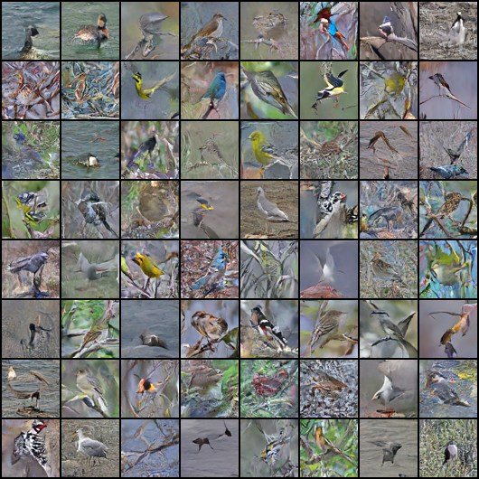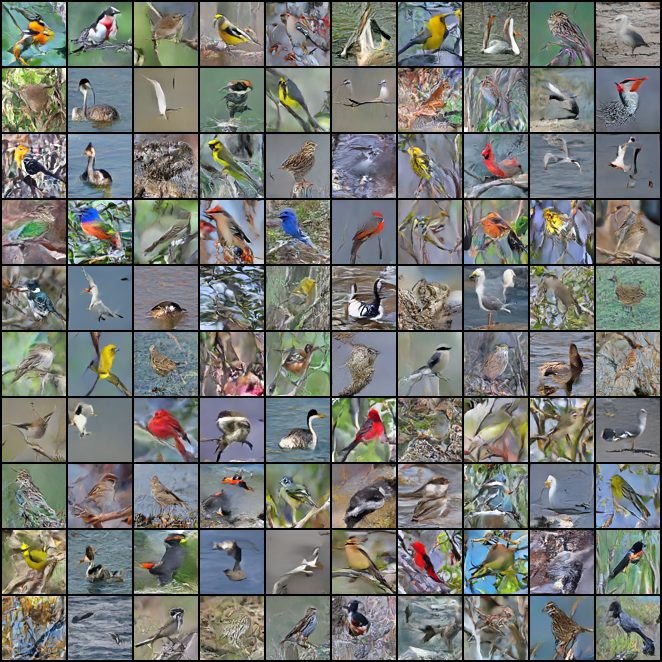 
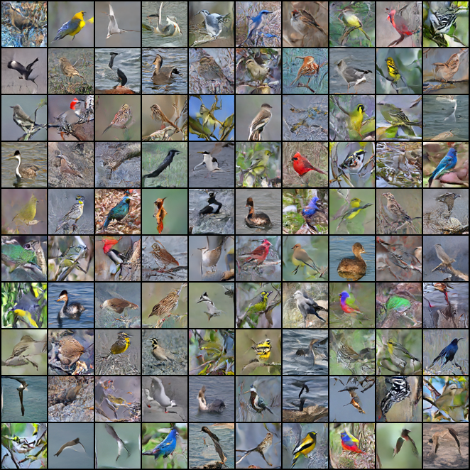 </p> <p align="center"> 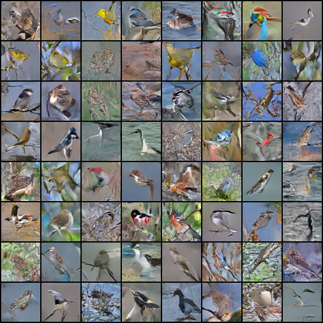 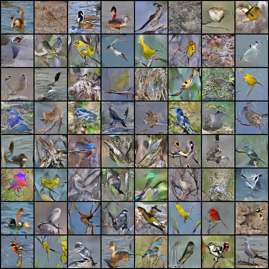 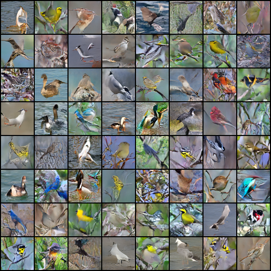 </p> <p align="center"> 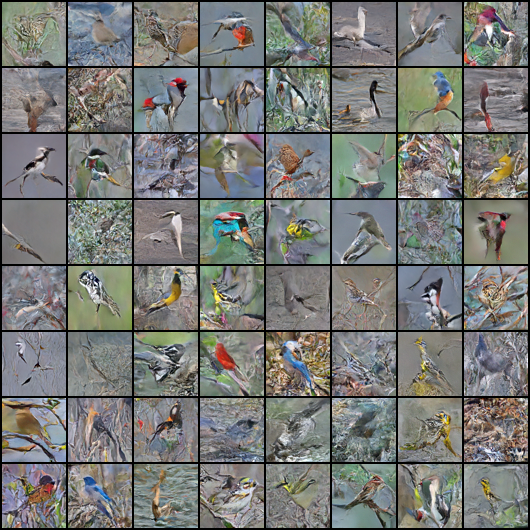 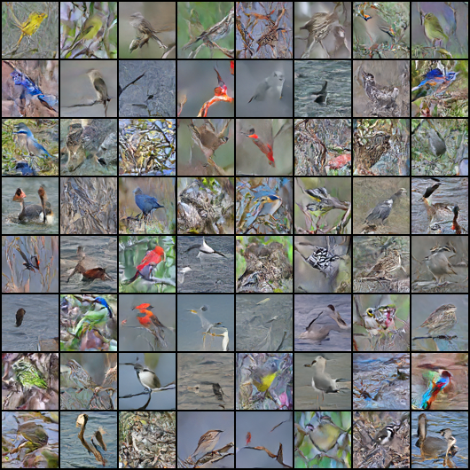 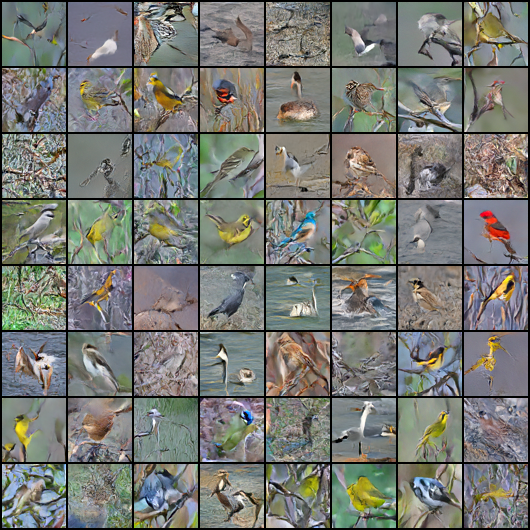 </p> <p align="center"> 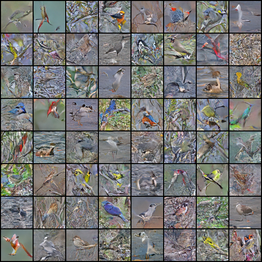 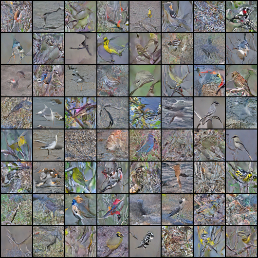 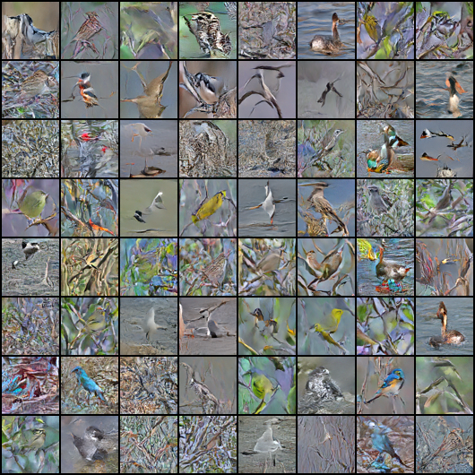 </p>
